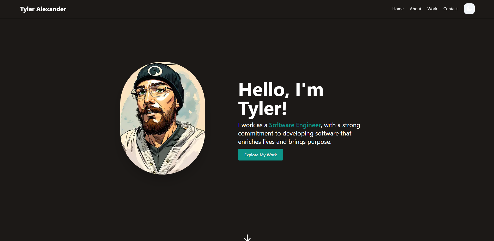

# Software Engineering Portfolio



This is the README file for your portfolio website built with TypeScript and Next.js. This document will provide you with important information about the project, how to set it up locally, and any additional configuration required for deployment, particularly when using Netlify.

## Table of Contents
- [Introduction](#introduction)
- [Getting Started](#getting-started)
  - [Prerequisites](#prerequisites)
  - [Installation](#installation)
- [Configuration](#configuration)
- [Deployment](#deployment)
- [License](#license)

## Introduction

This portfolio website is built using TypeScript and Next.js, which are powerful tools for creating modern, performant web applications. It allows you to showcase your projects, skills, and experience in a visually appealing manner.

## Getting Started

### Prerequisites

Before you begin, ensure you have met the following requirements:

- Node.js: You should have Node.js installed on your machine. You can download it from [nodejs.org](https://nodejs.org/).

### Installation

1. Clone this repository to your local machine:

   ```bash
   git clone https://github.com/your-username/your-portfolio.git
   ```

2. Navigate to the project directory:

   ```bash
   cd your-portfolio
   ```

3. Install the project dependencies:

   ```bash
   npm install
   ```

4. Start the development server:

   ```bash
   npm run dev
   ```

5. Open your web browser and visit [http://localhost:3000](http://localhost:3000) to see your portfolio website running locally.

## Configuration

The project may require some environment configuration, especially if you plan to deploy it using Netlify. Below is an example `.env` file that you can use as a reference:

```env
NEXT_FORCE_EDGE_IMAGES=true
# DISABLE_IPX=true
```

Please note that you may need to add one or both of these environment variables to your Netlify configuration variables when deploying with their service.

- `NEXT_FORCE_EDGE_IMAGES`: Setting this to `true` can help optimize image loading on your website. Ensure this variable is configured according to your needs.

- `DISABLE_IPX`: This variable appears to be commented out in the example. Depending on your use case and image optimization preferences, you can uncomment and configure it accordingly.

Make sure to review the Next.js and Netlify documentation for any additional configuration steps specific to your project.

## Deployment

To deploy your portfolio website, you can use various hosting services, and Netlify is a popular choice. Here are some general steps to deploy your Next.js portfolio on Netlify:

1. Push your project to a Git repository (e.g., GitHub).

2. Sign up for a Netlify account if you don't already have one.

3. Connect your Git repository to Netlify and configure your deployment settings.

4. Add the environment variables mentioned in the `.env` file to your Netlify project's environment variables configuration.

5. Trigger a manual or automatic deployment from the Netlify dashboard.

6. Once the deployment is successful, your portfolio will be live on a Netlify URL.

Remember to refer to the Netlify documentation for detailed instructions on deploying a Next.js project with Netlify.

## License

This portfolio project is licensed under the [MIT License](LICENSE). Feel free to modify and customize it to suit your needs. Good luck with your portfolio!